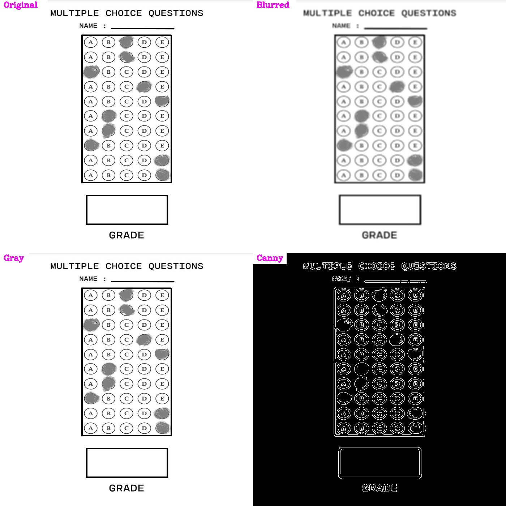
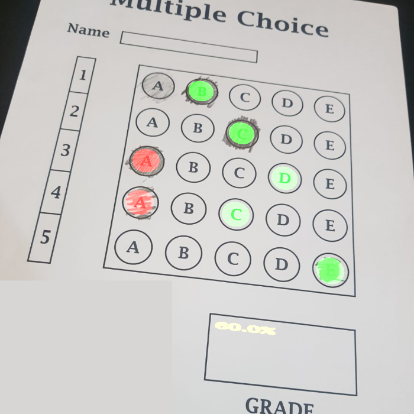

# Optical Mark Recognition (OMR) System

This project is an Optical Mark Recognition (OMR) system that processes scanned OMR sheets and automatically grades them. The system identifies the marked answers, compares them with the correct answers, and calculates the score.

## Features

- Preprocessing of scanned OMR sheets (grayscale conversion, blurring, edge detection, etc.)
- Detection and perspective transformation of the answer grid
- Extraction of marked answers from the OMR sheet
- Automatic grading based on predefined correct answers
- Save the processed and graded image with highlighted answers

## Results 

### After preprocessing 



### Final Results



## Installation

To run this project, make sure you have Python installed. Clone this repository and install the required libraries using pip:

```bash
git clone https://github.com/aymen-000/OMR-System.git
cd OMR-System
pip install -r requirements.txt
python main.py --img_path path/to/image.jpg --save_file path/to/save/output.jpg
```
## Arguments

- img_path: Path to the input image of the OMR sheet (required)
- width: Width of the output image (default: 700)
- height: Height of the output image (default: 700)
- questions: Number of questions on the OMR sheet (default: 5)
- choices: Number of choices per question (default: 5)
- save_file: Path to save the final output image (required)
- right_answers: The correct answers for grading the OMR sheet (a list of the index of the correct answers eg: 1,2,0,0,1)